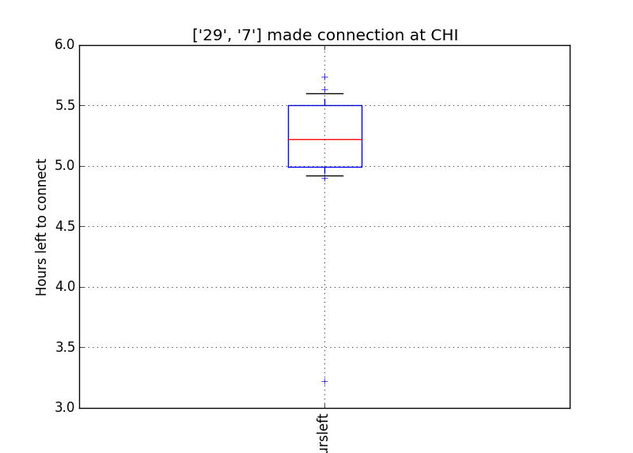

# Amtrak Connections

All credit for data, wonderful web service to John Bobinyec of
[statusmaps.com](http://statusmaps.com), as well as Amtrak.

Using archival data from statusmaps.net to do simple analysis of
transfer statistics (missed connections).

1. download ZIP file you\'re interested in from [statusmaps.net
    archives](http://www.dixielandsoftware.net/Amtrak/status/StatusPages/index.html),
2. EXTRACT using original directory structure.

Example:

```sh
python amtrak.py 29 7 -d 2013-05-15 2013-05-31
```

that examines connections between the Capitol Limited to the Empire
Builder for the latter half of May 2013


